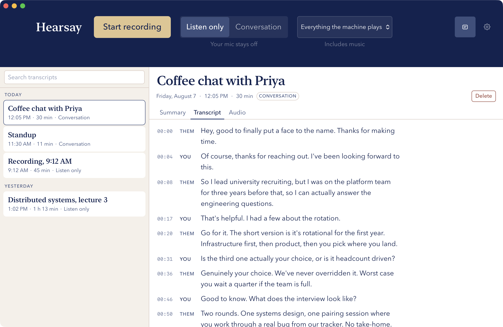
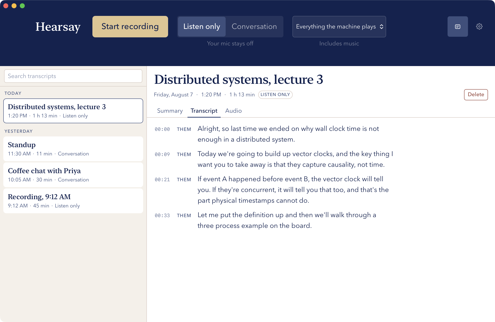

# Hearsay

Local-first macOS app that records meetings, transcribes them on-device, and stores them
as searchable events. Single user, single machine, no server, no accounts, no telemetry.



## What leaves your machine

Nothing, with two exceptions. Both are off until you turn them on, and both use your own
credentials:

1. **AI summaries** — only when you press the button, using your own API key. Claude or
   Gemini, whichever you prefer.
2. **Google Calendar** — only if you connect it. Read-only, titles and times only.
   Nothing is ever uploaded to Google.

Recordings, transcripts, and audio never go anywhere.

## What it does

- **Records system audio** using Core Audio process taps. No virtual audio device, no
  change to your sound output. Volume keys keep working, AirPods come and go.
- **Two modes.** `listen_only` (the default, every launch) records system audio only and
  never opens the microphone. `conversation` records both into one stereo WAV — left is
  you, right is everyone else.
- **Transcribes on-device** with `faster-whisper`, per channel, so you get speaker
  attribution for free.
- **Mute (⌘⇧M)** writes silence into your channel while the other side keeps recording.
- **Retroactive scrub (⌘⇧X)** erases the last 60 seconds of your microphone *before* it
  reaches disk — for the side conversation you only realised was sensitive after it
  started. Both hotkeys work while Hearsay is in the background.
- **Search everything** with full-text search and click-to-seek.
- **Optional AI summaries and calendar matching.** Without them, everything else works.

### Summaries

Off until you add a key, and the only feature that sends anything anywhere. Claude or
Gemini — your key, your account, your choice.

The prompt is deliberately opinionated, and it lives in one editable string in
`crates/hearsay-core/src/summary.rs`:

- **Bullets under headings named after the actual conversation**, not a fixed template. A
  recruiting session gets "The role" and "How to apply"; a coffee chat gets "About Dana"
  and "Advice she gave".
- **A closing "Worth remembering"** for what is easy to lose — names, roles, deadlines,
  numbers, and the personal details worth having before a follow-up.
- **Action items are a separate schema field**, with an owner of you / them / unassigned.
  Never a guessed name.
- **Nothing invented.** Undecided stays undecided, garbled stays out, and a muted stretch
  is passed to the model as a gap it is told not to speculate about.

Set your name in Settings and summaries address you by it instead of "you". **Copy
summary** puts formatted text and markdown on the clipboard together, so it pastes as real
headings and bullets into Google Docs and as markdown into a text editor.

Summaries are derived, never source: they regenerate from the stored transcript without
re-transcribing, and regenerating never overwrites a title you typed yourself.



Recordings are grouped by day. In `conversation` mode the left channel is you and the
right is everyone else, which is where the speaker labels come from — no diarisation
model, just the channel split. A muted stretch is written into the transcript rather than
left as an unexplained gap.

## Requirements

- macOS 14.4 or later (process taps). Built against 26.5.2.
- Apple Silicon.
- Rust, Node, and Python 3.10+ to build.

## Install

```sh
git clone https://github.com/grcfu/hearsay.git && cd hearsay
./python/setup_venv.sh     # faster-whisper — takes a few minutes
./helper/build.sh          # Swift audio helper
npm install
npm run tauri build        # produces the app
```

Then drag `target/release/bundle/macos/Hearsay.app` to `/Applications`.

To run from source instead while developing, use `npm run tauri dev`.

### “Apple could not verify Hearsay is free of malware”

Expected, and safe to bypass. Hearsay is not notarized, because notarizing needs a paid
Apple Developer account. (`install.sh` does sign it — with a free Apple Development
certificate when it finds one, ad-hoc otherwise — but signing is not notarization.) macOS
shows this for any app it did not get from the App Store or a registered developer. It is
a statement about *provenance*, not about the code.

To open it the first time:

**Right-click** (or Control-click) `Hearsay.app` → **Open** → **Open** in the dialog.

Double-clicking will not offer the bypass; the right-click menu is what unlocks it. You
only do this once — macOS remembers. On recent macOS you may instead need System Settings
→ Privacy & Security, scroll to the bottom, and click **Open Anyway** next to the message
about Hearsay.

### On first launch

macOS will ask for **Screen & System Audio Recording**. Grant it — without it a tap runs
and captures nothing but silence, which is the characteristic way audio capture fails.
Hearsay watches for it: if a minute goes by with audio playing and every captured sample
still zero, it says so during the recording rather than letting you find out afterwards.
**Microphone** is requested separately, and only the first time you use conversation
mode.

Permissions are tied to code identity, so the installed app needs its own grant even if
you already granted one to your terminal while building.

### Reinstalling after a change

```sh
cd /path/to/hearsay
./install.sh              # rebuild and replace /Applications/Hearsay.app
./install.sh --reset-tcc  # ...and clear the stored permission so macOS asks again
```

A rebuild takes about a minute. It is not incremental in the way a dev build is: the
frontend is compiled into the binary, so even a CSS change relinks the app. For
iterating on the interface, `npm run tauri dev` reloads in seconds — use `install.sh`
when you want the change in the real app.

### Getting someone else's changes

Hearsay tells you when the app is older than your checkout. It does this **without any
network request**: the binary records the commit it was built from, and compares that
against the repository already on this machine. There is no version endpoint and nothing
is fetched — "no update checks" stays intact because nothing is checked *remotely*.

After a `git pull`, the next launch shows a banner and a notification with the exact
command to run. To take new changes:

```sh
git pull
./install.sh
```

Nothing breaks if you skip it; you keep running the version you built. The one case that
needs care is the database. A newer build may migrate `hearsay.sqlite` forward, and an
older build then refuses to open it rather than risking your recordings — it says so in
a dialog and exits. Running `./install.sh` fixes it. Recordings are never touched by a
migration.

There is no auto-updater on purpose — an updater checks a server on every launch, and
"no update checks" is one of this project's non-negotiables. This script does the same
job from the source already on your disk.

**Permissions survive rebuilds if you have a signing identity.** macOS identifies an app
by its *designated requirement*. Ad-hoc signing makes that a content hash, which changes
on every build — so each rebuild looks like a new app and the permission must be granted
again. Signing with a certificate makes it bundle ID + certificate instead, which does
not change when the code does.

`install.sh` finds a code-signing identity in your keychain and uses it automatically,
and tells you which case you are in:

```
identified by certificate — permission grants persist across rebuilds.
```

An **Apple Development** identity is enough, and it is free with any Apple ID — no paid
Developer Program required. Create one in Xcode → Settings → Accounts → Manage
Certificates → **+** → Apple Development. Override the choice with
`HEARSAY_SIGNING_IDENTITY="..."` if you have several.

Without an identity the build falls back to ad-hoc, and `--reset-tcc` is the way to clear
a stale grant after each rebuild.

### Keep the checkout

**Do not delete the cloned repo after building.** The app finds the Python transcription
environment at `python/.venv` inside it. Move or delete the checkout and recording still
works, but transcription silently stops. The venv is not bundled into the app because
Python virtualenvs are not relocatable.

## Connecting a calendar (optional)

Google requires you to create your own OAuth credentials. Hearsay embeds none, so your
calendar access runs through a client you control and can revoke at
[myaccount.google.com/permissions](https://myaccount.google.com/permissions).

Settings → Calendar walks you through it in the app. In short:

1. Create a project in [Google Cloud Console](https://console.cloud.google.com/projectcreate).
2. Enable the **Google Calendar API**.
3. Configure the consent screen: **External**, add your own address as a test user.
4. **Publish the app.** ⚠️ While the status is "Testing", Google expires refresh tokens
   after **7 days** and you would have to reconnect weekly. Publishing stops that. Google
   then warns the app is unverified at sign-in — click **Advanced → Go to Hearsay
   (unsafe)**. That warning is about other people trusting your app; you are the only
   person who will use it.
5. Credentials → Create credentials → OAuth client ID → **Desktop app**. Paste the client
   ID and secret into Hearsay.

No redirect URI to configure — Desktop clients accept `127.0.0.1` on any port, and
Hearsay opens a local server on a random free port to catch the sign-in. Credentials and
tokens go into the Keychain, never into the database or a file.

## Where your data lives

Everything is in `~/Library/Application Support/hearsay/` — the SQLite database, the
`recordings/` folder, and downloaded speech models. Nothing is written anywhere else.

> **Back it up.** There is no cloud copy, because that is the point. If the disk fails,
> every recording is gone. Point Time Machine at an external drive, or:
>
> ```sh
> rsync -a --delete ~/Library/Application\ Support/hearsay/ /Volumes/YourDrive/hearsay/
> ```
>
> Avoid iCloud or Dropbox for this — it would send your meetings to a third party.

## Current limits

- **Apple Silicon only.** No Intel build.
- **Not notarized.** On a Mac other than the one that built it, Gatekeeper blocks the app
  until you right-click → Open. Notarizing needs a paid Apple Developer account.
- **Transcription needs the checkout**, as above. There is no self-contained installer.

## Development

`cargo test` runs the full suite. Tests that need real audio and real permissions are
marked `#[ignore]`; run them with audio playing:

```sh
cargo test -p hearsay-audio --test live_capture -- --ignored --nocapture
```

See [CLAUDE.md](./CLAUDE.md) for the specification: architecture, the audio helper
contract, the data model, and the design system.

## License

Private project. All rights reserved.
